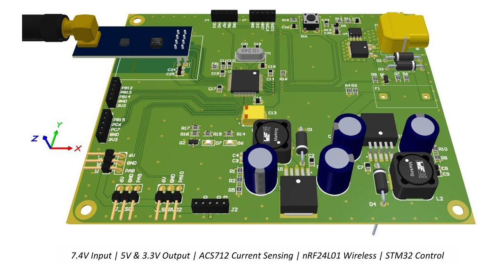
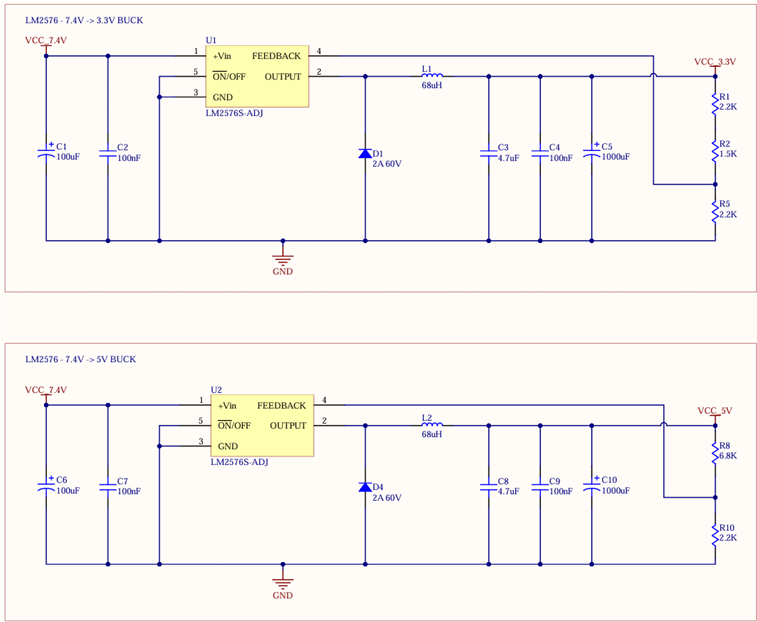
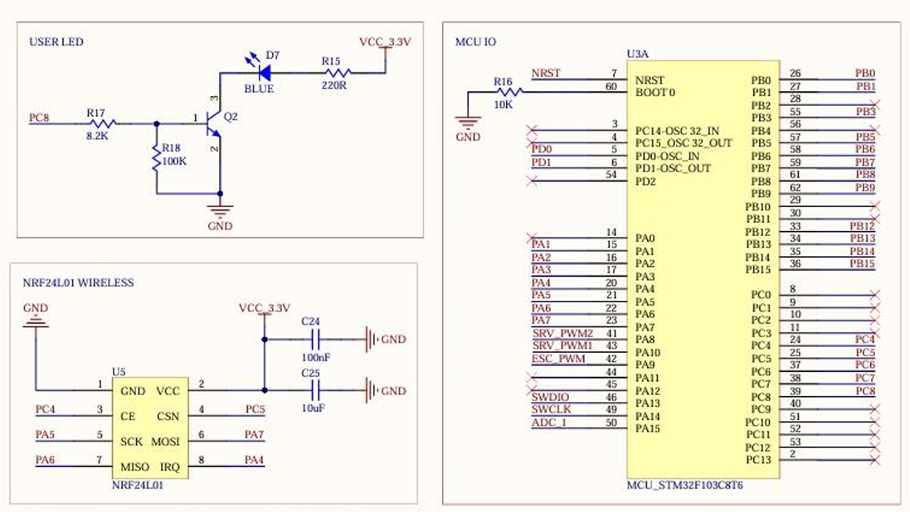
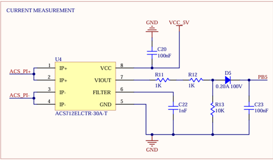
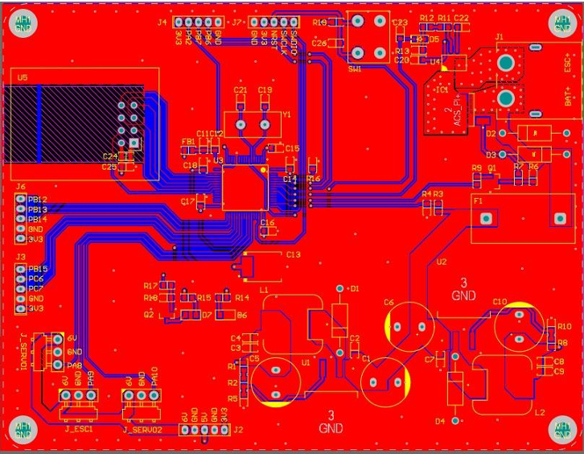
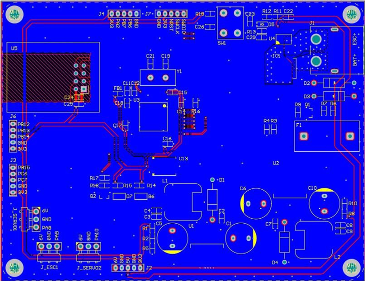

# STM32-Based Integrated Control & Power Management System

**Languages:** English | [Türkçe](README.tr.md)

A multi-purpose embedded control platform running from a 7.4 V (2S LiPo) battery, featuring high-efficiency power management and precise telemetry. The board powers its control unit and peripherals from **3.3 V and 5 V rails** generated by LM2576-based switching regulators. Real-time current monitoring via **ACS712** and ADC-based battery-voltage measurement keep power consumption under control, while **nRF24L01** wireless support, servo outputs, and expansion headers make it an open, programmable base for a range of applications.

`7.4V Input | 5V & 3.3V Output | ACS712 Current Sensing | nRF24L01 Wireless | STM32 Control`

---

## Table of Contents
- [Overview](#overview)
- [Key Features](#key-features)
- [Power Management & Voltage Regulation](#power-management--voltage-regulation)
- [MCU Power Supply & Filtering](#mcu-power-supply--filtering)
- [Microcontroller, System Management & Wireless](#microcontroller-system-management--wireless)
- [Current Measurement](#current-measurement)
- [High-Current PCB Design](#high-current-pcb-design)
- [What I Learned](#what-i-learned)

## Overview
This is a general-purpose embedded control and power-management board designed around the **STM32F103**. It takes a 2S LiPo (7.4 V) input and produces regulated 3.3 V and 5 V rails using switching regulators, so both the MCU and external peripherals run from a clean, efficient supply. On-board current sensing and battery-voltage measurement give the firmware full visibility into power draw, and a set of expansion headers, servo outputs, and an nRF24L01 wireless interface make the board reusable across different projects — from a vehicle controller to a general autonomous "mainboard."

## Key Features
- **Efficient dual-rail power:** LM2576-ADJ switching buck regulators produce 3.3 V and 5 V; output voltages are set precisely by feedback resistor dividers (R1-R2, R8-R10).
- **30 A current sensing:** ACS712 (30 A variant) monitors ESC/motor current in real time, with an RC filter (R11, R12, C22) for a clean signal to the ADC.
- **Battery telemetry:** ADC-based 2S LiPo voltage measurement through a resistor divider.
- **Clean MCU supply:** Per-pin decoupling, and an isolated analog rail (VDDA) via a ferrite bead + LP filter for accurate ADC readings.
- **Wireless link:** nRF24L01 (2.4 GHz) for remote control and live telemetry, placed with a ground-plane clearance under the antenna for stable impedance.
- **Expandable:** Servo outputs, ESC/BEC connector, ST-Link header, reset circuitry, and multiple expansion headers.

## Power Management & Voltage Regulation
Two **LM2576-ADJ** switching regulators generate the 3.3 V and 5 V rails from the 7.4 V input. The adjustable feedback dividers set each output precisely. Around the regulators, wide copper pours (polygon pour) manage heating and voltage drop, and the filter capacitors are placed physically as close as possible to the regulator input/output pins to suppress high-frequency noise and minimize output ripple.

## MCU Power Supply & Filtering
A careful filtering architecture keeps the STM32 running reliably:
- **Decoupling capacitors:** A dedicated 100 nF cap per supply pin, per the datasheet, to keep high-frequency noise off the core.
- **Analog supply (VDDA) isolation:** The VDDA rail is fed through a ferrite bead (FB1) and an LP filter stage (100 nF & 1 µF) to isolate it from digital noise for accurate ADC measurements.
- **Status & output:** A green power-on LED (D6) and a J2 power-output header for peripherals.
- **Component proximity:** All decoupling caps connect to the MCU supply pins by the shortest possible traces, minimizing trace inductance and improving power stability.

## Microcontroller, System Management & Wireless
- **STM32F103** — chosen for its PWM, ADC, and SPI capability, which cover the project's control and communication needs.
- **Clocking:** An 8 MHz external crystal with 22 pF load capacitors provides stable, accurate timing.
- **nRF24L01 (2.4 GHz):** Handles remote control and sends critical telemetry — current from the ACS712 and battery voltage — back to the user in real time. It is used as an external module to minimize RF design complexity (antenna impedance matching, etc.), reduce cost, and allow quick replacement. In the layout, the ground plane is intentionally *not* poured in the layers beneath the module's antenna; this clearance keeps the antenna impedance stable and maximizes range.

## Current Measurement
An **ACS712 (30 A)** sensor tracks the current drawn by the connected ESC/motor driver in real time. The sensor supports up to 30 A, giving safe headroom for high-power motor use. An RC filter (R11, R12, C22) damps measurement noise and delivers a clean signal to the MCU.

## High-Current PCB Design
A dedicated layout strategy lets the board carry 30 A loads safely around the ACS712:
- **Current-carrying capacity:** The sensor's input/output pins (ACS_PI+, ACS_PI-) are backed by maximum-width copper pours to minimize resistance and heating.
- **Layer bonding:** Top and bottom copper are tied together with many stitching vias, increasing the effective conduction cross-section and lowering inter-layer resistance.
- **Solder reinforcement:** Bottom-layer copper is left bare (solder-mask opening) so solder can be flooded onto those areas during assembly, boosting conductivity for maximum performance under 30 A.

| Top layer — signal routing & placement | Bottom layer — ground plane & power distribution |
|---|---|
|  |  |

## What I Learned
- **Altium & hardware design:** I used Altium end-to-end on this board — from building libraries to laying out the buck-converter power stages — and worked through the reasoning behind every choice: why each pin, why each capacitor value.
- **High-current & thermal:** On the 30 A traces I learned first-hand that wide copper alone isn't enough; via stitching and bottom-layer solder-mask openings matter for real current handling.
- **System integration:** This board is part of an ongoing project — the next step is a joystick that talks to it over the nRF link, completing a wireless control loop.
- **Firmware platform:** With its expansion pins and sensor interfaces, the board is a flexible "mainboard" I can reuse as a test bed for STM32 firmware across future autonomous projects.
